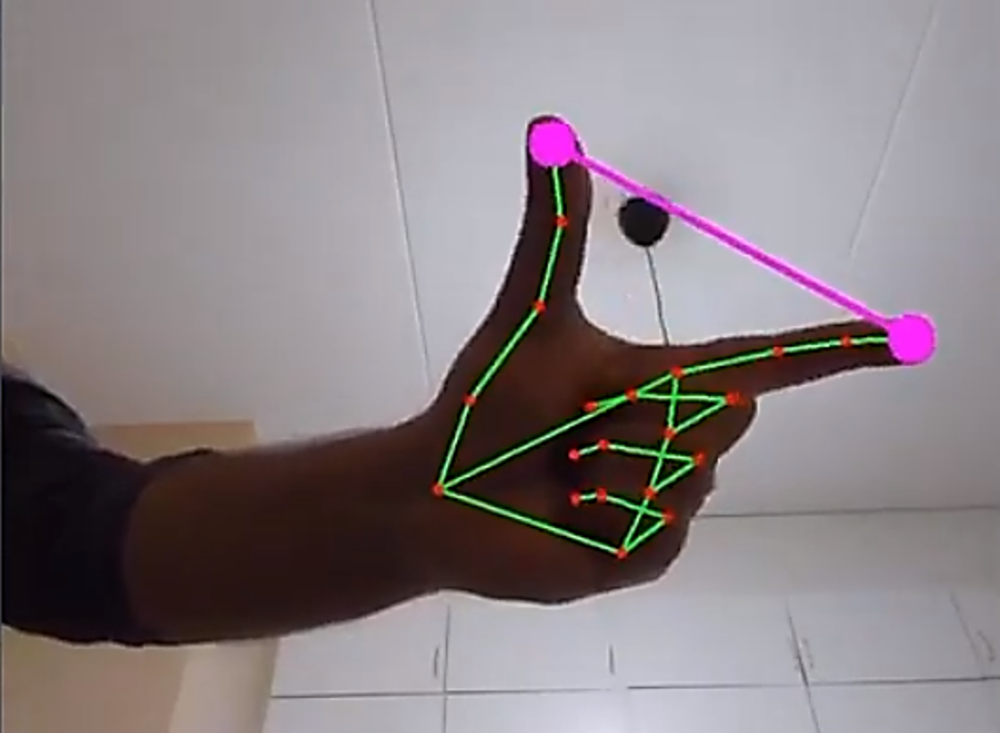

# virtualSoundControler
* Developed a Hand Gestures Volume Control System using 
Python, leveraging OpenCV for computer vision. Created an 
intuitive method to adjust audio playback volume using hand 
gestures captured by a camera. 
* Achieved benchmarks of 90-95% accuracy in gesture 
recognition.
* The system utilizes a camera to capture and interpret user 
hand gestures, providing a natural way to control volume levels.

To initiate the project 
step 1: 
    * install python 3.10 just becoz mediapipe module doesn't support latest version of python for now.

step2:
   * make alias 

    $ New-Alias -Name python310 -value "yourPython3.10.exe path"

     

step 3: 

create virtual env 

    $ python310 -m venv venv310

step 4:

Activate virtual environment

    $ venv310\scripts\activate

Step 5: install mediapipe module

    $ py -m pip install mediapipe

Step 6 install dependencies 

    $ pip install -r requirements.txt

step 7 to run project 

    $ python gui.py

# Sample pics 

<h1>Demo Of Hand Tracking</h1>

<video width="360" height="240" controls>  <source src="./dataSet/demoHandTracking1.mp4" type="video/mp4">  </video>

